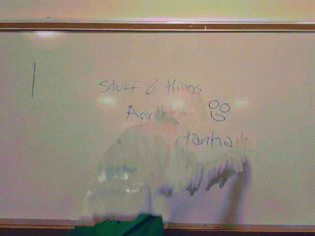

# Visiboard

## About the Project
**Visiboard** is a video recording platform with the ability to hide foreground objects between the camera and a whiteboard. The goal of this app is to allow teachers to record their lessons on a consistently displayed board for notetaking. Core features of the app focus on eliminating distractions from whiteboard videos for educational purposes and the quick retrieval of videos.

## Key Technologies:
### PyQt5
PyQt is used for creating the GUI that handles user interactions, including logging in, navigating dashboards, and managing video content.
### OpenCV
Opencv is essential for the detection and handling of whiteboards and foreground objects. It was also useful for applying filters and blurs making effective detection possible.

## Getting Started:
Setup with this project is extremely simple, however it does require a device with a camera attached

### Clone the Repository
`git clone https://github.com/Gabifern/TartanHacks2025.git`

Enter the working directory

`cd TartanHacks2025`

### Install Dependencies
It is recommended to setup a virtual enviroment for the dependencies

`pip install -r requirements.txt`

### Running the Application
Fairly straightforward. Recordings will be output to inputted path or current working directory

`python3 ui.py`

## Goals:
The platform aims to improve the learning experience by offering a streamlined way for educators to manage video content.
The key advantage is video clarity, as teachers can remove distractions (people) in the video, helping students focus on the core content.
Flexibility for teachers to decide the level of privacy and focus in the content they share with students.
Overall, this project provides a dynamic solution for educators to efficiently manage their teaching videos, and ensure that students get the best possible learning experience through focused, unobstructed content.

